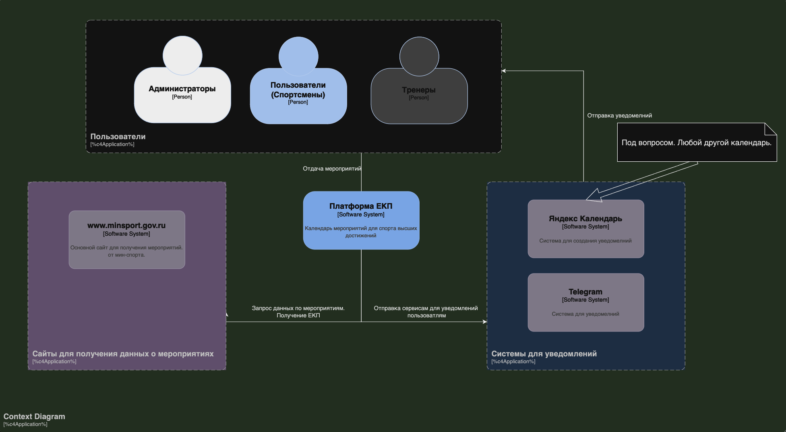
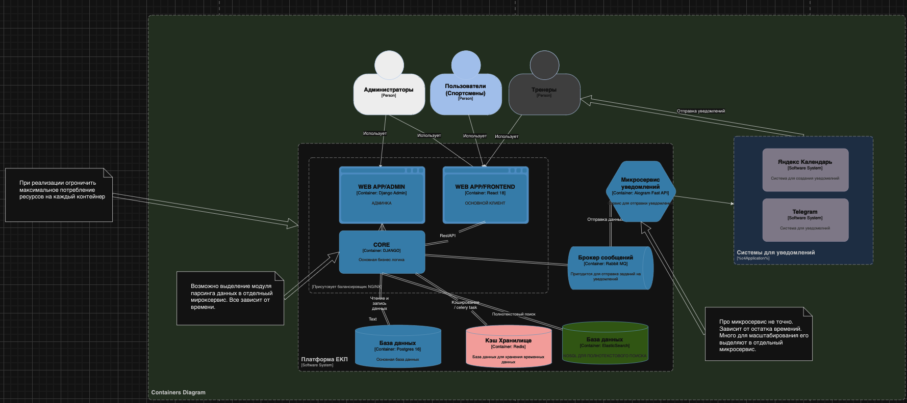
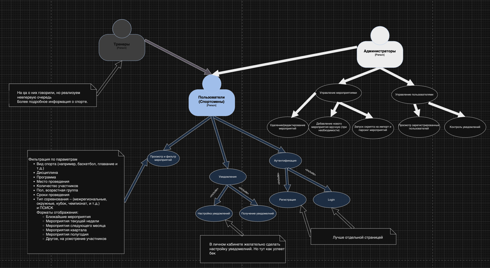
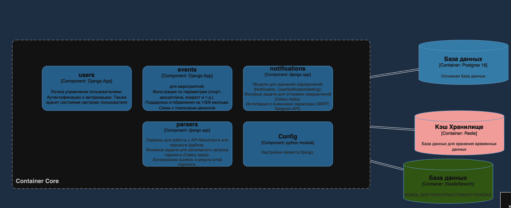
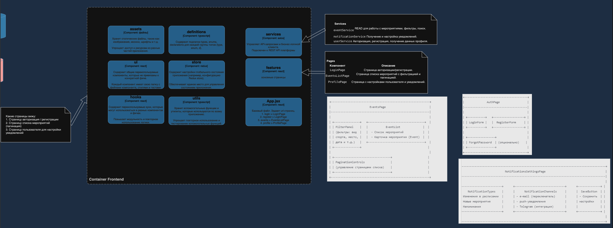

# 1. Определение целей

## Цель проекта

Создание интерактивной платформы для отображения спортивных мероприятий, которая:

- Упрощает доступ к актуальной информации о соревнованиях для спортсменов, администраторов.
- Персонализирует данные для каждого пользователя.
- Автоматизирует обработку данных из Единого календарного плана.

## Кому это нужно?

### 1. Спортсменам:
- **Быстрый доступ к мероприятиям по их виду спорта.**
- **Персонализированные уведомления о предстоящих соревнованиях.**

### 2. Администраторам:
- **Простой инструмент для распространения информации о мероприятиях.**
- **Автоматизация обновлений и уведомлений.**

## Архитектура приложения

Приложение построено с учетом современных требований к масштабируемости, модульности и надежности. Оно разделено на несколько микросервисов, которые работают в контейнерах и взаимодействуют друг с другом через API и брокеры сообщений. Основные аспекты архитектуры:

### 1. Масштабируемость

Приложение спроектировано так, чтобы его можно было легко масштабировать как вертикально (увеличение ресурсов), так и горизонтально (увеличение количества экземпляров сервисов):

- **Контейнеризация (Docker):**
   - Каждый сервис изолирован в отдельном контейнере, что позволяет запускать любое количество экземпляров.
   - Например, сервисы `core` (бэкэнд), `frontend`, `celery` и `celery-beat` можно масштабировать независимо в зависимости от нагрузки.

- **Брокер сообщений (RabbitMQ):**
   - Используется для асинхронной обработки задач, таких как уведомления или парсинг данных. Брокер позволяет распределять задачи между множеством воркеров (сервис `celery`).

- **Elasticsearch:**
   - Поисковый движок для обработки полнотекстовых запросов. Можно горизонтально масштабировать кластер для обработки больших объемов данных.

- **Redis:**
   - Кэширование для ускорения работы и временное хранилище. Уменьшает нагрузку на основную базу данных.

- **Балансировка нагрузки:**
   - `Nginx` выступает в роли реверс-прокси, распределяя запросы между различными контейнерами.

### 2. Модульность

Каждая часть приложения четко разделена на функциональные модули, что упрощает разработку, тестирование и сопровождение:

- **Микросервисный подход:**
   - **Backend (Django):**
      - Реализует бизнес-логику. Разделен на подмодули:
         - `users`: управление пользователями, регистрация, авторизация, настройки.
         - `events`: работа с мероприятиями (создание, редактирование, фильтрация).
         - `notifications`: отправка уведомлений и интеграция с внешними системами.
         - `parsers`: регулярный парсинг данных из внешних источников, таких как API Минспорта.
         - `config`: базовые настройки проекта.
      - Каждый модуль можно дорабатывать или масштабировать отдельно.

   - **Frontend (React):**
      - Разделен на следующие компоненты:
         - `features`: страницы, такие как список мероприятий, авторизация, настройки уведомлений.
         - `ui`: интерфейсные элементы, общие для всего приложения.
         - `store`: управление состоянием через Redux.
         - `services`: API-клиенты для взаимодействия с бэкэндом.

   - **Microservice Notifications:**
      - Отдельный сервис для отправки уведомлений через Telegram и другие каналы.

- **Интеграции:**
   - Внешние API для получения данных (например, Минспорт).
   - Системы уведомлений (Telegram).
   - Возможность добавления новых интеграций через адаптеры.

### 3. Структура базы данных

Приложение использует реляционную базу данных **PostgreSQL** и NoSQL-хранилище **Elasticsearch**. Каждая из баз данных выполняет свою роль:

#### 3.1 PostgreSQL (основная база данных)

- **Таблицы:**
   - **Users:**
      - Поля: `ID`, `имя`, `email`, `пароль` (хэширован), `настройки уведомлений`.
      - Связь с событиями и уведомлениями (`Foreign Key`).

   - **Events:**
      - Поля: `ID`, `название`, `дата`, `место проведения`, `вид спорта`, `дисциплина`, `возрастная группа`.
      - Возможность фильтрации и поиска по ключевым параметрам.

   - **Notifications:**
      - Поля: `ID`, `тип уведомления`, `пользователь`, `канал` (email, Telegram), `статус отправки`.
      - Логи о доставке уведомлений.

   - **Parsers:**
      - Поля: `ID`, `источник` (URL или API), `дата последнего парсинга`, `статус`.
      - Логи ошибок и результатов.

- **Особенности:**
   - Использование индексов для ускорения запросов по популярным полям (например, дата проведения мероприятия, вид спорта).
   - Полнотекстовый поиск в некоторых полях (напр., описание событий) при помощи Postgres Full-Text Search.

#### 3.2 Elasticsearch (поисковое хранилище)

- **Роль:** Обеспечение быстрого полнотекстового поиска и фильтрации данных мероприятий.
- **Документы:**
   - **События (Events):**
      - Поля: `название`, `место`, `вид спорта`, `описание`, `дата`.
      - Поддержка сложных поисковых запросов (например, «мероприятия в Москве для детей по баскетболу»).

- **Особенности:**
   - Легко масштабируется горизонтально.
   - Используется для аналитики и обработки больших объемов данных.

### 4. Уведомления

- **Каналы:**
   - Telegram, email, push-уведомления.

- **Механизм работы:**
   - Все уведомления добавляются в очередь через RabbitMQ.
   - Celery-воркеры обрабатывают задачи, отправляя сообщения через соответствующие API.

### 5. Логика работы

- Пользователь регистрируется через страницу авторизации.
- Получает доступ к списку мероприятий с фильтрами (например, вид спорта, дата, место).
- Может настроить уведомления по интересующим его событиям.
- Администраторы загружают данные через парсеры или вручную добавляют новые события.
- Все изменения автоматически индексируются в Elasticsearch для мгновенного поиска.

---

# Архитектура компонента "Парсинг данных"

## 1. Основная задача компонента

Парсер разработан для автоматизации обработки данных о спортивных мероприятиях. Он предназначен для извлечения структурированных данных из PDF-документов, предоставленных Министерством спорта, а также для анализа этих данных с целью их дальнейшей интеграции в систему.

## 2. Ключевые аспекты решения

### 2.1 Web-scraping для получения PDF-файлов

- Используется библиотека `requests` для отправки HTTP-запросов на сайт Министерства спорта.
- Полный HTML-контент страницы анализируется для поиска ссылок на PDF-файлы, содержащие данные ЕКП (Единый Календарный План).
- Алгоритм фильтрует PDF-файлы:
   - По их названиям (содержат "ЕКП").
   - По дате обновления (выбирается самый свежий файл).

### 2.2 Извлечение текста из PDF

- Используется библиотека `PyPDF2` для чтения PDF-файлов:
   - Текст извлекается постранично для последующего анализа.
   - Учитываются особенности формата файлов, такие как наличие служебных строк ("Стр. x из y").

### 2.3 Обработка и структурирование данных

Парсер проходит несколько этапов для преобразования извлеченного текста в удобную для работы таблицу:

#### Этап 1: Разделение данных

- **Разделение на записи по видам спорта:**
   - Спорт выделяется из текста с помощью заранее составленного списка спортивных дисциплин (например, "Баскетбол", "Легкая атлетика").
   - Учитывается наличие специальных категорий, таких как "Молодежный (резервный) состав".

#### Этап 2: Извлечение ключевых полей

- Для каждой записи извлекаются следующие данные:
   - **Наименование мероприятия:** Название и ключевые характеристики события.
   - **Категория участников:** Пол, возрастные ограничения (например, "Юниоры 14-17 лет").
   - **Даты:** Начало и окончание мероприятия.
   - **Место проведения:** Адрес и страна.
   - **Количество участников:** Последнее число в описании мероприятия интерпретируется как общее число участников.
   - **Тип соревнования:** (например, "Чемпионат", "Первенство").

#### Этап 3: Очистка и нормализация данных

- **Обработка текста для удаления:**
   - Служебных строк.
   - Дублирующей информации.
   - Лишних пробелов, дефисов и сокращений.

- **Применение регулярных выражений для форматирования:**
   - Удаление дат, не относящихся к описанию.
   - Форматирование диапазонов возраста ("12-15 лет").

#### Этап 4: Определение дополнительных параметров

- **Пол участников:** Определяется на основе ключевых слов в описании (например, "юниоры", "мужчины", "девушки").
- **Возрастные группы:** Для каждой категории участников выделяются минимальный и максимальный возраст.
- **Тип мероприятия:** Указывается по ключевым словам ("Чемпионат", "Кубок").

### 2.4 Используемые технологии

- **Python-библиотеки:**
   - `PyPDF2`: Для работы с PDF-документами.
   - `re`: Регулярные выражения для очистки и анализа текста.
   - `pandas`: Для обработки данных в табличной форме.

- **Модульность:**
   - Код разделен на функции для повышения читабельности и поддержки:
      - `extract_text_from_pdf`: Извлечение текста из PDF.
      - `clean_category`: Очистка категорий участников.
      - `parse_record`: Анализ одной записи мероприятия.
      - `split_text_into_records_with_sport_and_reserve`: Разделение текста на записи по видам спорта.

### 2.5 Масштабируемость решения

- **Парсер легко адаптируется для новых форматов данных:**
   - Добавление новых типов документов (например, Excel).
   - Интеграция с другими источниками данных через API.

- **Расширение списка видов спорта и стран:**
   - Достаточно обновить списки в конфигурации.

### 2.6 Преобразование данных в DataFrame

После обработки парсер возвращает данные в виде таблицы `DataFrame`. Поля:

- **№ СМ в ЕКП:** Уникальный идентификатор мероприятия.
- **Наименование мероприятия:** Полное название.
- **Вид спорта:** Дисциплина (например, "Баскетбол").
- **Категория участников:** Возраст, пол и уровень участников.
- **Начало и Окончание:** Даты проведения.
- **Место проведения:** Город, регион, страна.
- **Количество участников:** Количество зарегистрированных участников.
- **Тип соревнования:** ("Чемпионат", "Первенство", "Кубок").

### 2.7 Внедрение в систему

- **Парсер интегрирован с бэкэндом:**
   - Загруженные данные автоматически передаются в основную базу `PostgreSQL` для дальнейшей обработки.
   - Уведомления о новых данных отправляются через `Celery` и `RabbitMQ`.

### 2.8 Примеры применения

- **Администраторы:**
   - Могут импортировать данные о мероприятиях в несколько кликов.
   - Парсер автоматически обновляет данные при появлении новых PDF-файлов.

- **Пользователи:**
   - Получают структурированную информацию о мероприятиях, фильтруемую по дате, виду спорта и месту проведения.

### 2.9 Архитектура проекта в UML представлении

